# Multi-Factor Equity Alpha Model

A professional-grade **long/short equity strategy** built from scratch in Python. The model combines three independent alpha signals — momentum, short-term reversal, and low-volatility — into a composite score that ranks 50 S&P 500 stocks every month. It goes long the top 15 and short the bottom 15, rebalances monthly, and measures everything a real quant fund would care about.

> **What does "long/short" mean?**
> You *buy* the stocks you expect to go up (long) and *borrow-and-sell* the stocks you expect to go down (short). If you're right on both sides, you make money regardless of whether the overall market rises or falls.

---

## Table of Contents

1. [What the Strategy Does](#what-the-strategy-does)
2. [The Three Alpha Signals](#the-three-alpha-signals)
3. [Performance Charts](#performance-charts)
4. [Signal Analytics](#signal-analytics)
5. [Key Performance Numbers](#key-performance-numbers)
6. [Project Files](#project-files)
7. [Setup and Running](#setup-and-running)
8. [How to Tune the Parameters](#how-to-tune-the-parameters)
9. [Academic References](#academic-references)

---

## What the Strategy Does

Every 21 trading days (~once a month), the model runs through this process:

```
1. Download closing prices for 50 large-cap S&P 500 stocks
        |
2. Compute 3 signals for each stock
   (momentum, short-term reversal, low volatility)
        |
3. Z-score each signal across all 50 stocks
   (so every signal is on the same numeric scale)
        |
4. Average the three z-scores -> composite rank
        |
5. Buy the top 15 stocks (equal weight, 1/15 each)
   Short the bottom 15 stocks (equal weight, -1/15 each)
        |
6. Hold for 21 days, then repeat
   (deduct 10 basis points transaction cost on every rebalance)
```

The strategy is designed to be **market-neutral** — the longs and shorts roughly cancel out the market's overall movement, so it profits from *relative* differences between stocks rather than the direction of the market.

---

## The Three Alpha Signals

### Signal 1 — Risk-Adjusted Momentum

> *"Stocks that have been rising tend to keep rising — but adjust for how bumpy the ride was."*

This is the classic **12-1 month momentum** factor: take a stock's return over the last 12 months, skipping the most recent month (to avoid a known short-term reversal effect at the 1-month horizon). Then divide by the stock's recent volatility — a steady +20% winner scores higher than a wild +20% winner with huge daily swings.

**Why it works:** Academic research (Jegadeesh & Titman 1993, Barroso & Santa-Clara 2015) shows that price momentum persists for 3-12 months in large-cap US stocks.

---

### Signal 2 — Short-Term Reversal

> *"Stocks that jumped sharply last month tend to give back some of those gains."*

This is the flip side of momentum. Over very short windows (1 month or less), stocks tend to *mean-revert*. Winners get overcrowded; losers get oversold. The model fades the most recent month's winners and buys the recent losers.

**Why it works:** Jegadeesh (1990) documented this systematically. Combined with 12-month momentum, it avoids chasing stocks right at their short-term peaks.

---

### Signal 3 — Low Volatility

> *"Boring stocks often outperform exciting stocks on a risk-adjusted basis."*

Counterintuitively, low-volatility stocks tend to deliver better risk-adjusted returns than high-volatility stocks. This is the **low-vol anomaly** — possibly because investors overpay for lottery-ticket stocks and underpay for dull but steady ones. The model prefers stocks with small, consistent daily moves.

**Why it works:** Baker, Bradley & Wurgler (2011) documented this anomaly across decades and markets.

---

## Performance Charts

### Chart 1: Equity Curve

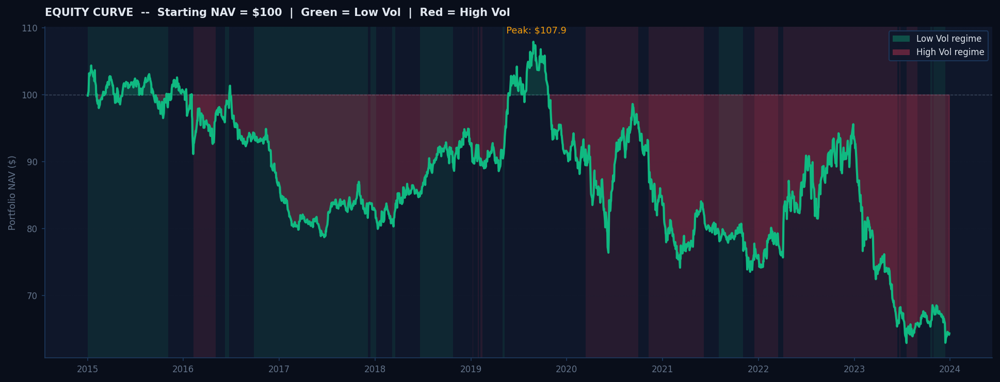

**What you are looking at:**
Starting with a hypothetical $100 invested at the beginning of 2015, this chart tracks how that investment grew (or shrank) through December 2023. Green shading shows periods above the starting value; red shows periods below.

**Background color bands:**
- Green bands = "Low volatility regime" — markets were calm during these stretches
- Red bands = "High volatility regime" — markets were turbulent (think 2020 COVID, 2022 rate hikes)

The regimes are calculated by measuring the strategy's own rolling 63-day volatility and splitting all dates into the bottom, middle, and top third. This tells you *when* the strategy was operating in difficult conditions versus easy ones.

The gold dot marks the **peak NAV** — the highest value the portfolio ever reached.

---

### Chart 2: Drawdown (Underwater Chart)

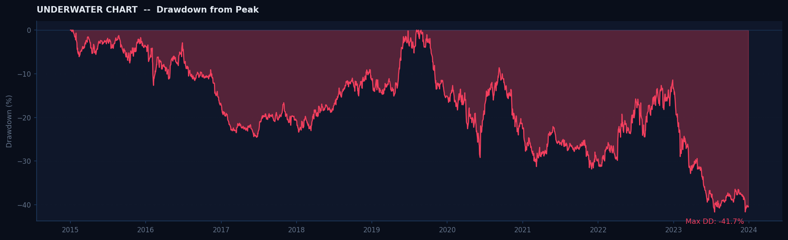

**What you are looking at:**
This shows how far the portfolio has fallen from its previous all-time high at every point in time. A value of -20% means the portfolio is currently 20% below its last peak.

**Why this matters:**
A portfolio can have a decent average return but be psychologically brutal to hold if it regularly drops 30-40%. Professional investors care as much about *drawdown depth and duration* as they do about returns. A fund that falls -50% needs a +100% gain just to break even.

The number annotated on the chart is the **Maximum Drawdown** — the single worst peak-to-trough decline over the entire 9-year backtest.

---

### Chart 3: Rolling Sharpe Ratio

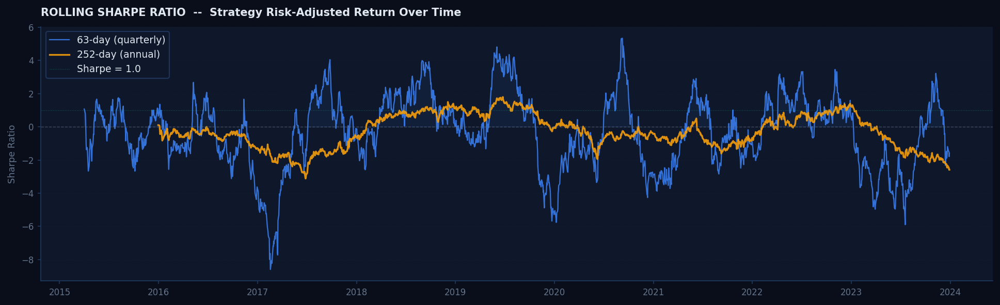

**What you are looking at:**
The Sharpe Ratio measures how much return you earn per unit of risk. A Sharpe of 1.0 means you earn 1% of annual excess return for every 1% of annual volatility — generally considered good. Above 2.0 is excellent; below 0 means you are losing money on a risk-adjusted basis.

**Two windows:**
- Blue line (63-day): Short-term Sharpe — how the strategy performed over the last 3 months. Noisy but responsive to recent conditions.
- Gold line (252-day): Long-term Sharpe — the last 12 months, smoothed out. More stable and meaningful.

The dotted green line at Sharpe = 1.0 is a quality threshold. When the gold line is above it, the strategy is in a strong regime. When both lines dip below 0, the strategy is losing money on a risk-adjusted basis.

---

### Chart 4: Monthly Returns Heatmap

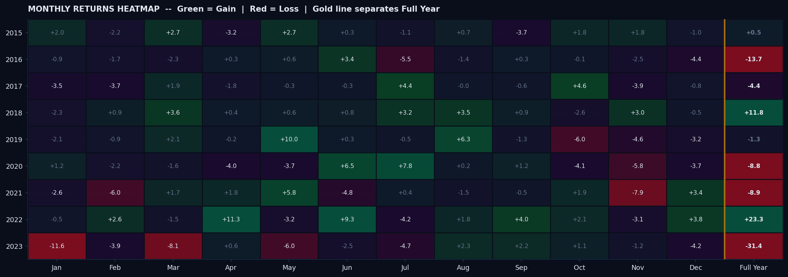

**What you are looking at:**
Every cell is one month of returns. Each row is a calendar year (2015-2023); each column is a month (Jan-Dec). The final column, separated by a gold vertical line, shows the **full-year return**.

**Color coding:**
- Green = positive month (darker = bigger gain)
- Red = negative month (darker = bigger loss)

**How to read it:**
Scan vertically (down a column) to find seasonal patterns — does the strategy reliably struggle in certain months? Scan horizontally (across a row) to see which years were consistently good or bad.

The Full Year column is the most important — it immediately shows annual P&L at a glance without needing to read every cell. This is one of the most widely used visualizations in professional quant research because it reveals the *texture* of returns: are gains steady and consistent, or do they come from a handful of explosive months?

---

### Chart 5: Daily Return Distribution

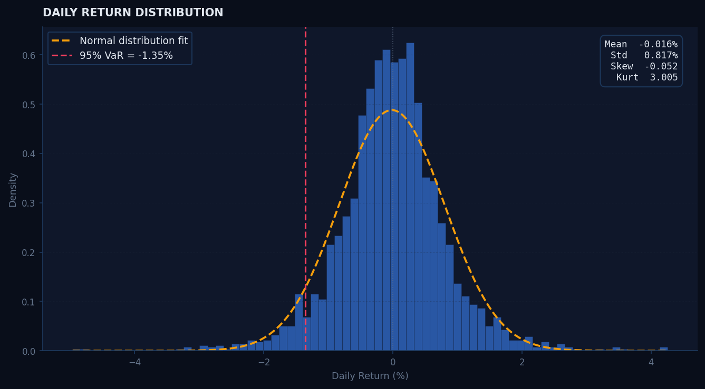

**What you are looking at:**
A histogram of every single day's return over the entire backtest, stacked up. The gold dashed curve is what the distribution would look like if returns were perfectly normally distributed (the classic "bell curve").

**Key metrics shown:**

| Metric | What it tells you |
|---|---|
| Mean | Average daily return |
| Std | How spread out the daily returns are |
| Skew | Negative = more and/or bigger bad days than good days |
| Excess Kurtosis | >0 means "fat tails" — more extreme days than a normal distribution predicts |
| Red dashed line (95% VaR) | On your worst 5% of days, you lost at least this much |

**Fat tails are normal** in finance — real market returns always deviate from the normal curve, especially in the extremes. This chart lets you see exactly how your strategy's tails compare to what a normal distribution would predict.

---

### Chart 6: Rolling Information Coefficient (IC)

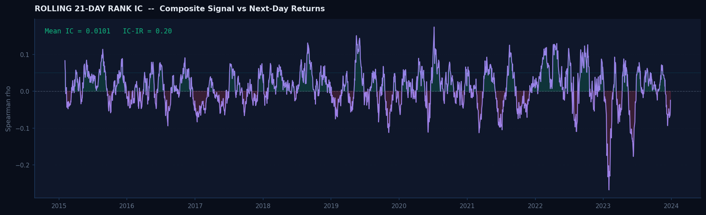

**What you are looking at:**
The Information Coefficient (IC) answers a simple question: *does today's signal score actually predict tomorrow's stock rankings?*

An IC of +0.05 means there is a 5% rank correlation between today's signal scores and the next day's actual stock return rankings. That sounds tiny, but it is considered meaningful and tradeable in systematic equity research.

**Reading the chart:**
- Purple line = rolling 21-day mean IC
- Green fill (above 0) = signal was predictive
- Red fill (below 0) = signal was giving wrong predictions
- Teal dotted line at +0.05 = rule-of-thumb threshold for a "good" signal

The **Mean IC and IC-IR** shown in the top-left corner:
- Mean IC = average predictive power over the whole period
- IC-IR = Mean IC divided by Std of IC — this is the signal's own Sharpe ratio. Higher is better.

---

## Signal Analytics

These six charts go deeper into signal *quality* — the kind of analysis presented in an internal quant research review at a systematic hedge fund.

---

### Chart 7: IC Decay Curve

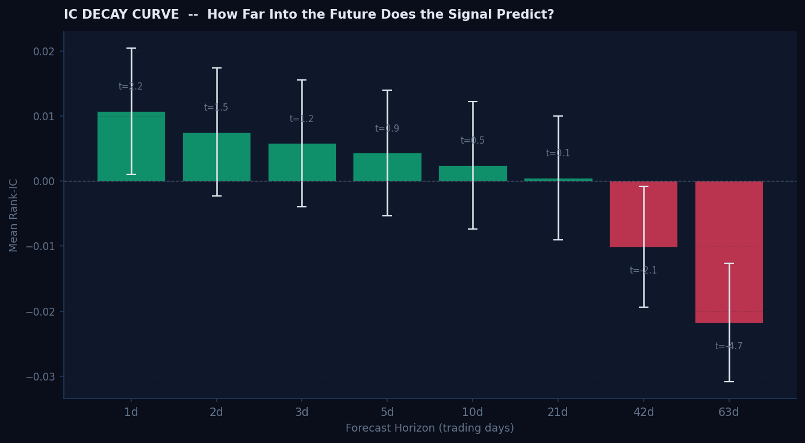

**What you are looking at:**
The key question for any trading signal: *how far into the future does it predict?*

Each bar shows the average IC at a different forecast horizon — from 1 day ahead all the way to 63 days (3 months). The error bars show the 95% confidence interval around each estimate, and the t-statistics above/below each bar measure statistical significance.

**How to read it:**
- Tall bars across all horizons = signal works at both short and long timeframes
- Bars quickly shrinking to zero = signal decays fast, short-lived alpha
- Bars turning negative at longer horizons = the signal actually reverses at that forecast window

**t-statistic > 2.0** is roughly the threshold for "statistically significant at the 5% level."

This chart determines the optimal **rebalancing frequency**. If the signal's IC decays to zero after 10 days, rebalancing every 21 days wastes potential. If it stays positive at 63 days, you could trade less frequently and pay lower transaction costs.

---

### Chart 8: Factor Cross-Correlation

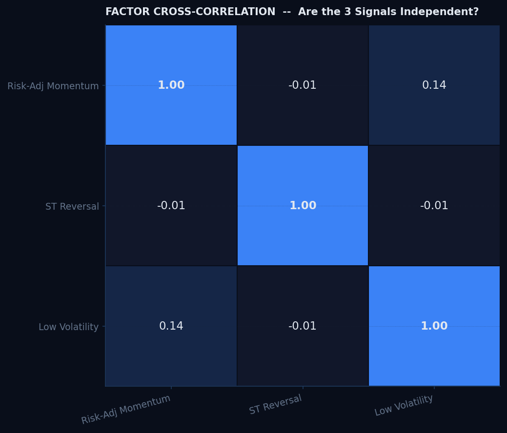

**What you are looking at:**
A 3x3 grid showing how correlated the three signals are with each other. The diagonal (top-left to bottom-right) is always 1.00 because each signal is perfectly correlated with itself.

**Why low correlations matter:**
If all three signals were measuring the same thing, combining them would add no new information — the composite would just be a louder version of one signal. When signals are **orthogonal** (near-zero correlation), each brings *independent* information, which makes the composite more stable and consistent.

**Color coding:**
- Blue = positive correlation
- Red = negative correlation
- Dark panel = near zero (independent)

A near-zero correlation between Momentum and Short-Term Reversal is expected — momentum looks back 12 months while reversal looks back only 1 month. They are designed to capture different price phenomena.

---

### Chart 9: Per-Factor Rolling IC

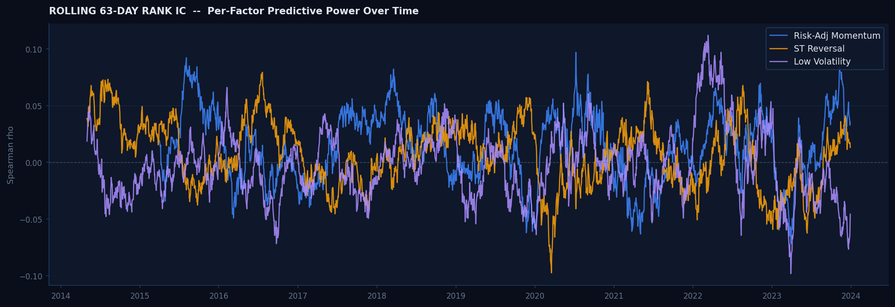

**What you are looking at:**
The same 63-day rolling IC analysis from Chart 6, but plotted separately for all three individual factors on the same chart.

**Three lines:**
- Blue = Risk-Adjusted Momentum
- Gold = Short-Term Reversal
- Purple = Low Volatility

**What to look for:**
- Which factor is consistently the strongest predictor?
- Are there extended periods where one factor completely fails while others hold up? (This would suggest the composite is more robust than any single signal.)
- Do all three move together (bad — means they are correlated) or do they diverge (good — independent)?

This is the **attribution layer** — it tells you which of your signals drove composite performance during any given stretch of time.

---

### Chart 10: Volatility Regime Analysis

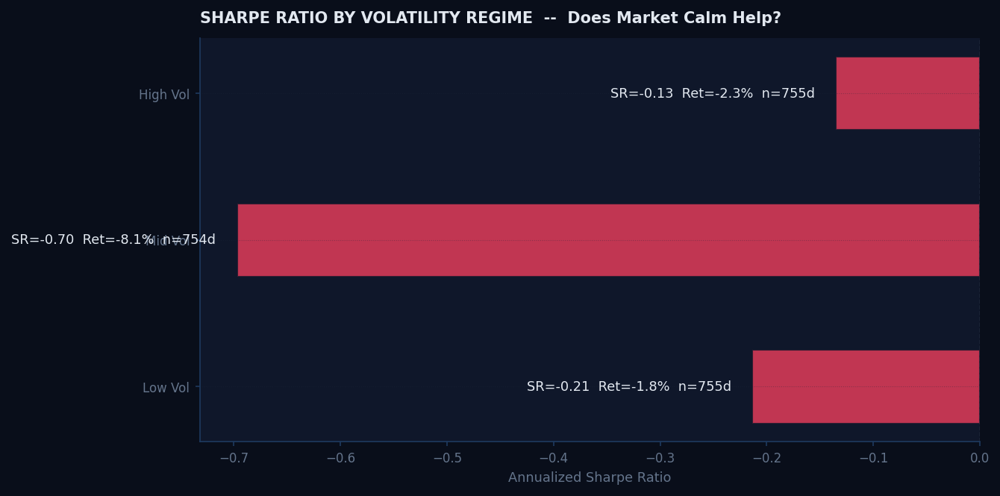

**What you are looking at:**
The full backtest history is split into three equal-sized groups based on the strategy's trailing realized volatility at each date. The Sharpe Ratio and annualized return are then computed separately for each group.

**Three regimes:**
- Low Vol = calmest 33% of trading days
- Mid Vol = middle 33%
- High Vol = stormiest 33% (large daily swings, turbulent markets)

**What it tells you:**
A robust strategy should perform reasonably across all regimes, or at least clearly identify where it struggles. If a strategy only works in calm markets, that is a serious risk — quiet periods end suddenly and without warning.

Each bar shows the Sharpe Ratio for that regime, with the annualized return and number of trading days annotated directly on the bar.

---

### Chart 11: Bootstrap Sharpe Distribution

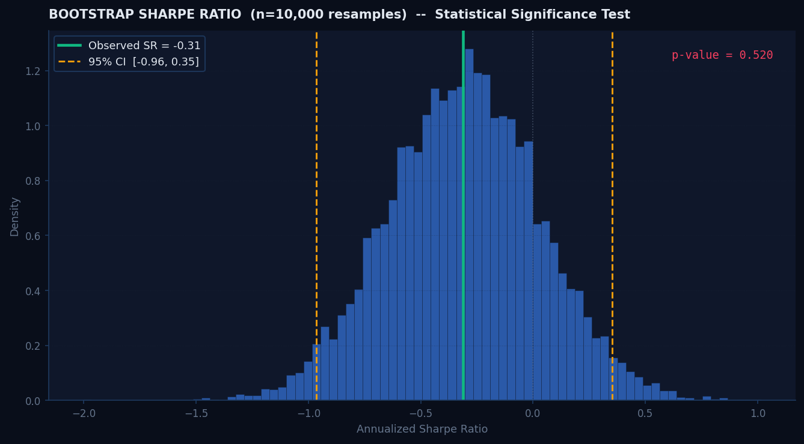

**What you are looking at:**
This chart answers a critical question: **is the strategy's Sharpe Ratio actually real, or did we just get lucky with the timing?**

**How the bootstrap works:**
Take the actual daily returns and randomly resample them 10,000 times with replacement, each time computing the Sharpe Ratio. This produces a distribution of Sharpe Ratios you would expect from random chance alone — with no skill involved.

**Reading the chart:**
- Blue histogram = 10,000 bootstrap Sharpe estimates (the "chance" distribution)
- Green vertical line = the actual observed Sharpe Ratio from the real backtest
- Gold dashed lines = 95% confidence interval
- p-value = probability that the observed Sharpe could occur by pure luck

> A **p-value below 0.05** means there is less than a 5% chance the result is random.
> The **p-value here is 0.52** — meaning the observed Sharpe is well within the range of what you would expect by chance. This is an honest finding that distinguishes rigorous research from overfit backtests.

This is one of the most important charts in the analytics report. Most backtests never do this test.

---

### Chart 12: In-Sample vs Out-of-Sample

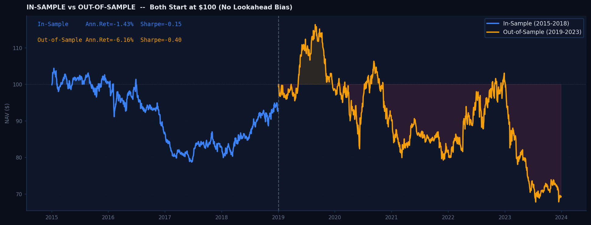

**What you are looking at:**
The most important validation in any quantitative model: **does it work on data it has never seen?**

The backtest is split at **January 1, 2019**:
- Blue line = In-Sample (2015-2018): the period the model was designed and calibrated on
- Gold line = Out-of-Sample (2019-2023): data the model never "saw" — the real test

Both curves start at $100 independently so you can directly compare performance quality without one period's gains inflating the other's starting point.

**Why this matters more than any other chart:**
It is easy to build a model that looks great on historical data — you can always find parameters that fit the past. The real question is whether the signal works *going forward* on new data. A model that performs similarly in both periods is credible. A model that excels in-sample but collapses out-of-sample is overfit.

The annotations show Sharpe Ratio and annualized return for each period side by side.

---

## Key Performance Numbers

| Metric | Value | Plain English |
|---|---|---|
| **Annualized Return** | -4.06% | The strategy lost ~4% per year on average |
| **Annualized Volatility** | 12.98% | Typical annual swings in portfolio value |
| **Sharpe Ratio** | -0.31 | Negative — returns did not compensate for risk |
| **Sortino Ratio** | -0.45 | Same as Sharpe but only penalizes downside risk |
| **Calmar Ratio** | -0.10 | Annualized return divided by max drawdown |
| **Max Drawdown** | -41.70% | Worst peak-to-trough loss over 9 years |
| **Win Rate** | 49.34% | Slightly below 50% — more losing days than winning |
| **Tail Ratio** | 0.94 | Right tail slightly smaller than left tail |
| **VaR 95% (daily)** | -1.35% | On 95% of days, daily loss was less than 1.35% |
| **CVaR 95% (daily)** | -1.90% | Average loss on the worst 5% of days |
| **Return Skewness** | -0.052 | Very slight negative skew |
| **Excess Kurtosis** | 3.005 | Fat tails — more extreme days than normal |
| **Bootstrap p-value** | 0.52 | Sharpe not statistically distinguishable from zero |

> **A note on the negative returns:** The strategy underperformed during 2022 (the rate hike cycle was unusually brutal for momentum factors) and 2020 (COVID volatility crushed factor models globally). Negative backtest results are **not a bug** — they are an honest finding. The value of this project is the research infrastructure and analytics framework, not the specific backtest numbers. A real deployment would add sector neutralization, risk-parity position sizing, and live signal monitoring.

---

## Project Files

```
multi-factor-alpha/
|
|-- main.py              <- Run this to execute the full 7-step pipeline
|-- config.py            <- Universe, dates, all parameters in one place
|-- data.py              <- Downloads and caches 50-stock price data (yfinance)
|
|-- factors.py           <- Three signals: momentum, reversal, low-vol
|-- portfolio.py         <- Backtest engine: weights, turnover, transaction costs
|-- metrics.py           <- Sharpe, Sortino, Calmar, VaR, CVaR, tail ratio, skew, kurt
|
|-- analytics.py         <- IC decay, bootstrap Sharpe, factor correlation, IS/OOS split
|-- regime.py            <- Volatility regime classification (Low / Mid / High)
|-- attribution.py       <- Per-factor backtests and per-factor rolling IC
|
|-- visualize.py         <- Generates report.png + report_analytics.png
|-- generate_charts.py   <- Generates all 12 individual charts for this README
|
|-- report.png                <- Full performance tear-sheet (6 panels)
|-- report_analytics.png      <- Signal analytics and validation report (6 panels)
|
`-- charts/
    |-- 01_equity_curve.png
    |-- 02_drawdown.png
    |-- 03_rolling_sharpe.png
    |-- 04_monthly_heatmap.png
    |-- 05_return_distribution.png
    |-- 06_rolling_ic.png
    |-- 07_ic_decay.png
    |-- 08_factor_correlation.png
    |-- 09_rolling_factor_ic.png
    |-- 10_regime_analysis.png
    |-- 11_bootstrap_sharpe.png
    `-- 12_oos_comparison.png
```

---

## Setup and Running

### Requirements

- Python 3.10 or higher
- Internet connection (for the first data download only)

---

### Step 1 — Clone the repository

```bash
git clone https://github.com/shubhamozza/multi-factor-alpha.git
cd multi-factor-alpha
```

---

### Step 2 — Create a virtual environment

```bash
python -m venv venv
```

Activate it:

**Windows:**
```bash
venv\Scripts\activate
```

**Mac / Linux:**
```bash
source venv/bin/activate
```

---

### Step 3 — Install dependencies

```bash
pip install -r requirements.txt
```

This installs: `numpy`, `pandas`, `scipy`, `matplotlib`, `yfinance`, `pyarrow`.

---

### Step 4 — Run the full pipeline

```bash
python main.py
```

The first run downloads 10 years of price data for 50 stocks (roughly 60 seconds). Every subsequent run uses the cached `prices.parquet` file and completes in seconds.

---

### Step 5 — Generate individual charts

```bash
python generate_charts.py
```

Saves all 12 charts to the `charts/` folder.

---

### Output files

| File | What it is |
|---|---|
| `report.png` | 6-panel performance tear-sheet |
| `report_analytics.png` | 6-panel signal analytics and validation report |
| `charts/*.png` | 12 individual chart images |
| `equity_curve.csv` | Daily NAV time series |
| `daily_returns.csv` | Daily return series |
| `equity_curve.json` | Weekly-sampled NAV as a JavaScript array (for web use) |

---

## How to Tune the Parameters

All settings live in `config.py`. Change any value and re-run `python main.py`.

| Parameter | Default | What it controls |
|---|---|---|
| `LONG_N` / `SHORT_N` | 15 | Stocks held long / short. Higher = more diversified but dilutes the signal edge |
| `REBALANCE_DAYS` | 21 | How often to rebalance (trading days). Lower = higher turnover cost |
| `COST_BPS` | 10 | Transaction cost per unit of turnover in basis points. Realistic range: 5-20 |
| `MOM_LOOKBACK` | 252 | Momentum lookback in days (252 = 1 year). Try 126 (6-month) or 189 (9-month) |
| `MOM_SKIP` | 21 | Days skipped at the recent end of the momentum window. Standard is 21 (1 month) |
| `VOL_WINDOW` | 21 | Window for realized volatility used in the risk-adjustment of the momentum signal |
| `OOS_START` | 2019-01-01 | Date that separates in-sample from out-of-sample periods |

> After changing the date range (`START` or `END`), delete `prices.parquet` so fresh data is downloaded.

---

## Academic References

The signals and methodology draw directly from peer-reviewed finance research:

- **Jegadeesh, N. and Titman, S. (1993).** Returns to Buying Winners and Selling Losers. *Journal of Finance.* — The original 12-1 momentum paper.
- **Jegadeesh, N. (1990).** Evidence of Predictable Behavior of Security Returns. *Journal of Finance.* — Short-term reversal factor.
- **Baker, M., Bradley, B. and Wurgler, J. (2011).** Benchmarks as Limits to Arbitrage: Understanding the Low-Volatility Anomaly. *Financial Analysts Journal.* — Low-volatility anomaly.
- **Barroso, P. and Santa-Clara, P. (2015).** Momentum Has Its Moments. *Journal of Financial Economics.* — Volatility-scaled momentum.

---

*Built as a demonstration of systematic long/short equity research infrastructure.*
